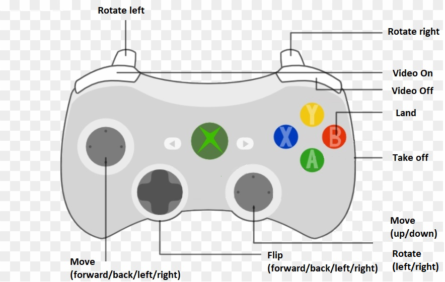

# TelloJS
A Node-based DJI Tello drone controller that can be run in a browser

## Installation:
TelloJS is tested and works with NodeJS v10.16.3 and npm v6.9.0 on both Ubuntu 20.04 and Windows 10. It should work with other operating systems and new versions of node, but it has not yet been tested on them. The following installation instructions assume you have one of the two above operating systems.

### On Ubuntu
First, download and extract this repository or clone it via git and change into that directory.

```shell
git clone https://github.com/lvoytek/TelloJS.git
cd TelloJS
```

Next, install npm and node:

```shell
curl -o- https://raw.githubusercontent.com/nvm-sh/nvm/v0.34.0/install.sh | bash
source ~/.nvm/nvm.sh
nvm install 10.16.3
```

Finally, install ffmpeg for viewing video in the browser. Use your OS's specific package manager if not on Ubuntu or any of its derivatives.

```shell
sudo apt update
sudo apt upgrade
sudo apt install ffmpeg
```

### On Windows

To make things easier, use the Git Bash application for working with git and NodeJS. It can be found [here](https://gitforwindows.org/).

Download and extract this repository or use Git Bash to clone it and go into its directory.

```shell
git clone https://github.com/lvoytek/TelloJS.git
cd TelloJS
```

Next, download the [Windows msi installer for NodeJS](https://nodejs.org/en/download/). The most recent LTS version should work but you can go to the Previous Releases link to find 10.16.3 if necessary.

ffmpeg.exe comes with this repo and therefore does not need to be installed to run video.

## Running:

In a terminal or Git Bash instance go into the TelloJS repository folder and start the local NodeJS Express server.

```shell
npm start
```
Connect to the Tello Drone via Wifi.

Then, in a Chrome or Chromium web browser, (controller layout varies in other web browsers,) go to [http://localhost:3000/](http://localhost:3000/). Plug in an XBox 360 controller (more controller support will be available in the future) and press start.

## Controls
